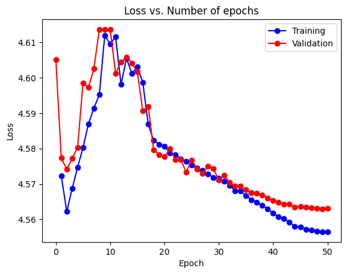
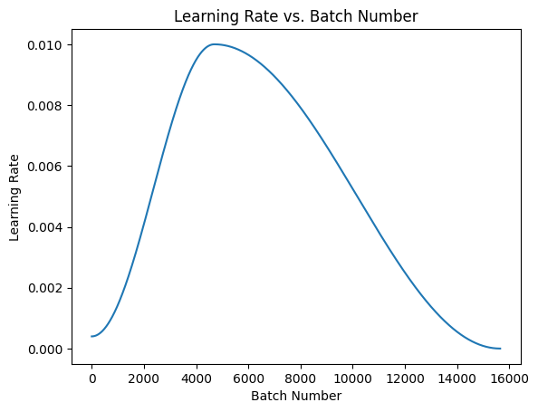
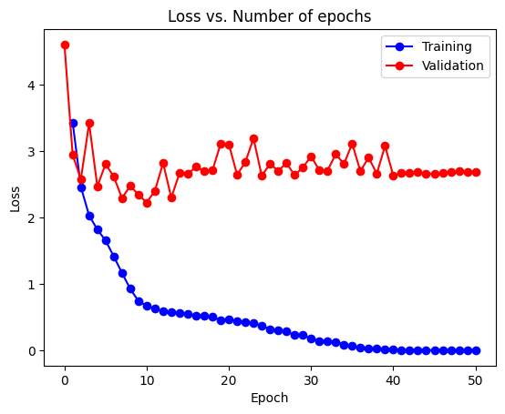
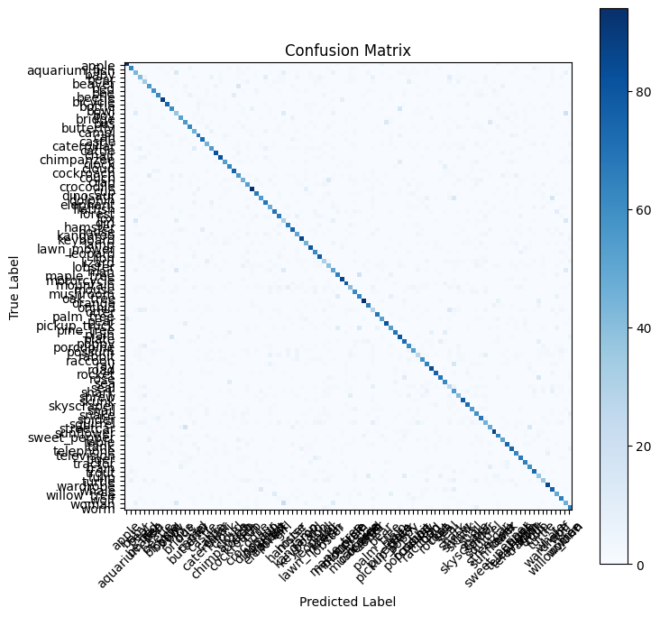
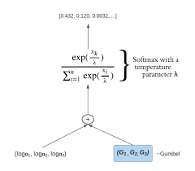
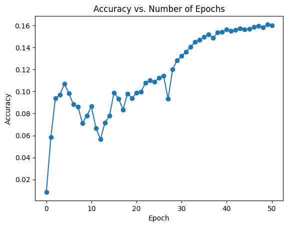
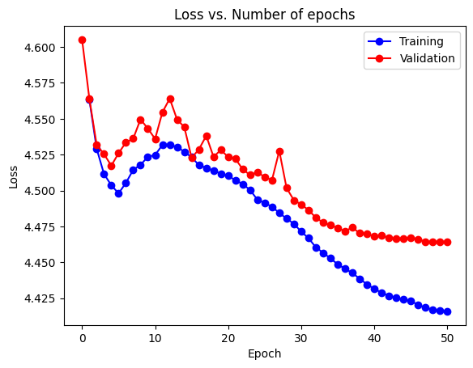

## Overview of the task

The task ....

# Analysis of implementation of different variations of Softmax on CNN for image classification

The softmax function is a widely used activation function in neural networks, particularly in classification tasks. However, its computational complexity is a concern when dealing with a large number of classes. 

In this study, I explore  and try to implement different softmax variations and their impact on model performance and training time in the context of image classification tasks using the CIFAR-100 dataset. The task is to develop a convolutional neural network (CNN) model with the standard softmax and compare it with two alternative softmax implementations, namely logsoftmax and Gumbel-Softmax. These models were then evaluated using various performance metrics, including accuracy, precision, recall, F1 score, and confusion matrix, and compare their performance and epoch time.

---

## Introduction

Neural networks have revolutionized image classification tasks, and the softmax function has become a popular choice for generating probabilistic outputs. However, its time complexity grows linearly with the number of classes, making it computationally expensive for large-scale classification problems. 

To address this issue, alternative softmax implementations have been proposed, such as logsoftmax and Gumbel-Softmax, which aim to reduce the computational complexity while maintaining performance.

logsoftmax reduces this this complexity to O(logN)

---

## Methodology:

In this study, we employ the CIFAR-100 dataset, consisting of 100 classes of images, to compare the performance of different softmax variations in CNN models. We first develop a baseline CNN model with the standard softmax implementation. Then, we create two additional models using the same architecture but replacing the softmax layer with logsoftmax and Gumbel-Softmax, etc.

### Standard Softmax Mode

Test Loss: 4.564

Test Accuracy: **5.696 %**

--

### LogSoftmax

On implementing LogSoftmax instead of standard softmax, the accuracy improved drastically. I think this is due to the fact that when using normal softmax, the vectors being exponentiated, increase the error by a lot; heavily hindering the performance of the model. But log softmax, simply converts vectors into probability, rather then exponential average. Not only does this reduce complexity but maintains the relative difference, which in this case seems to have helped.

Test Loss: 2.577

Test Accuracy: **61.96%**

Precision: 0.6097 | Recall: 0.6143 | F1 Score: 0.6097

The training and validation loss didn't follow each other which seems to indicate a loss in precision of model, needing further evaluation.

--

### Gumbel-Softmax

This variation of softmax is just like standard softmax with a temperature term, "reducing" the vectors.

On training the model on this I could see an increase in the accuracy of the model on increasing the value of **λ**.

Test Loss : 4.465

Test Accuracy: **15.85%**

The above accuracy was with the value of λ = 3, on having value <=1 the accuracy didn't even reach 8%. Overall the learning rate wrt the number of epochs didn't change much.

